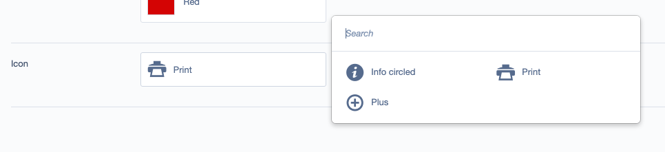

# Icon Field

Designed to be used with icon fonts, you configure it like so:

```
IconPickerField::create(
    'Icon',
    'Icon',
    [
        'font-icon-info-circled' => 'Info circled',
        'font-icon-print' => 'Print',
        'font-icon-plus' => 'Plus',
    ]
)
```

## Screenshots



## Requirements

* SilverStripe ^4

## Installation
```
composer require silverstripe/iconfield
```

## License
See [License](license.md)

## Maintainers
 * Adrian Humphreys <adrhumphreys@gmail.com>

## Bugtracker
Bugs are tracked in the issues section of this repository. Before submitting an issue please read over
existing issues to ensure yours is unique.

If the issue does look like a new bug:

 - Create a new issue
 - Describe the steps required to reproduce your issue, and the expected outcome. Unit tests, screenshots
 and screencasts can help here.
 - Describe your environment as detailed as possible: SilverStripe version, Browser, PHP version,
 Operating System, any installed SilverStripe modules.

Please report security issues to the module maintainers directly. Please don't file security issues in the bugtracker.

## Development and contribution
If you would like to make contributions to the module please ensure you raise a pull request and discuss with the module maintainers.
